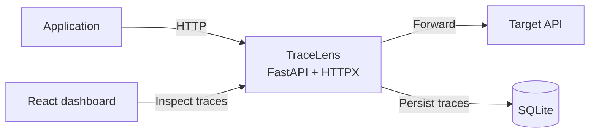

# TraceLens

**A local API observability and debugging proxy for developers.**

TraceLens sits between an application and its HTTP API. It forwards traffic to a configured target, captures each exchange in local SQLite storage, and provides a React dashboard for investigating failures and latency.



## Quick Start

Prerequisites: Python $>=3.12,<3.15$, Node.js 20+, and `make`.

```bash
make backend-install
make frontend-install
```

Start TraceLens against an upstream service:

```bash
make backend TARGET=http://localhost:8000
```

In another terminal, start the dashboard:

```bash
make frontend
```

Open `http://127.0.0.1:5173`. Point an application at `http://127.0.0.1:9000`; TraceLens forwards requests to the target and records them locally.

## Development

The `Makefile` provides the common commands:

| Command | Purpose |
| --- | --- |
| `make test` | Run the backend test suite |
| `make frontend-test` | Run the dashboard test suite |
| `make lint` | Lint the backend and dashboard |
| `make build` | Produce a dashboard production build |
| `make backend TARGET=http://localhost:8000` | Start the local proxy |
| `make frontend` | Start the dashboard development server |

To run without `make`:

```bash
cd backend
python3.12 -m venv .venv
.venv/bin/python -m pip install -e ".[dev]"
.venv/bin/python -m pytest
```

```bash
cd frontend
npm ci
npm run dev
```

Vite proxies local `/api` requests to TraceLens on port `9000`.

## API

| Endpoint | Description |
| --- | --- |
| `GET /api/health` | Confirm the local management API is running |
| `GET /api/traces` | List traces, including endpoint latency analysis; filter by `path`, `status_code`, `min_duration_ms`, or `max_duration_ms` |
| `GET /api/traces/{id}` | Inspect the complete captured exchange and its latency analysis |
| `POST /api/traces/{id}/analysis` | Request explicitly consented external analysis for a failed trace |
| `GET /api/metrics` | Get request count, error rate, average latency, and P95 latency |
| `DELETE /api/traces` | Permanently clear locally stored trace history |

```bash
curl 'http://127.0.0.1:9000/api/traces?status_code=500&min_duration_ms=300'
curl http://127.0.0.1:9000/api/metrics
```

## V1

- Async HTTP reverse proxy built with FastAPI and HTTPX
- SQLite-backed capture of request method, path, status, timestamp, and duration
- React and TypeScript dashboard for traffic metrics and trace details
- Server-side filters for endpoint, HTTP status, and latency
- Safe capture defaults: local binding, sensitive-header redaction, and bounded text-body capture

TraceLens is deliberately a local developer tool. HTTPS interception, streaming, and remote deployment are deferred.

## V2: Latency Anomalies

TraceLens derives a baseline from the five preceding traces with the same HTTP method and path. A request is marked as a latency anomaly when it takes at least twice that baseline. Analysis is calculated from locally retained traces when they are read, so it introduces no extra persisted data or migration.

The trace list and detail APIs include `baseline_duration_ms`, `latency_increase_ratio`, and `is_anomaly`. The dashboard marks anomalous requests and shows the baseline comparison in trace detail.

## V3: AI-Assisted Failure Analysis

Failure analysis is disabled by default. Configure an OpenAI-compatible chat-completions endpoint, a model, and an API key to enable it:

```bash
export TRACELENS_AI_API_KEY='your-provider-key'
make backend TARGET=http://localhost:8000 \
  BACKEND_ARGS='--ai-endpoint https://api.openai.com/v1/chat/completions --ai-model gpt-4.1-mini'
```

For a failed trace, the dashboard requires an explicit consent checkbox before TraceLens contacts the provider. Captured request and response bodies are excluded by default and require a separate opt-in. TraceLens sends the failed trace plus up to five recent successful requests to the same method and path; captured headers have already passed through TraceLens header redaction. API keys remain in the process environment and are never stored in SQLite or returned by the API.

AI context is capped at `24 KiB` by default, with oversized captured fields truncated before sharing. TraceLens retries transient transport failures and `429` rate limits twice by default, using capped backoff. Configure the limits with `--ai-max-context-bytes` and `--ai-max-retries`. Provider responses must satisfy a strict JSON schema. Each analysis action records only local audit metadata: timestamp, trace ID, selected model, body-sharing choice, outcome, provider status, and attempt count. Prompts and analysis results are never written to the audit table.

## Architecture

The full V1 implementation contract covers module boundaries, request lifecycle, data model, REST API, proxy behavior, failure handling, concurrency, privacy, testing, and architectural tradeoffs.

Read [the V1 architecture](docs/architecture.md#L1).

## Quality Gates

GitHub Actions runs backend tests and Ruff checks on Python 3.12, plus dashboard tests, linting, and a production build on Node.js 20, for every pull request and push to `main`.

## Repository Layout

```text
tracelens/
  backend/                  # Python CLI, proxy, storage, and REST API
  frontend/                 # React and TypeScript dashboard
  docs/
    architecture.md         # Canonical V1 technical design
    screenshots/            # Dashboard images and demos
  .github/
    workflows/              # CI
  Makefile                  # Common development commands
  LICENSE                   # MIT
```

## Roadmap

- **V1:** local proxy, trace persistence, REST API, dashboard, CI, and documentation
- **V2:** endpoint latency baselines and slow-request anomaly detection
- **V3:** optional AI-assisted failure analysis with explicit data-sharing controls

## Status

V3 complete. AI analysis is opt-in and disabled until a provider is configured.