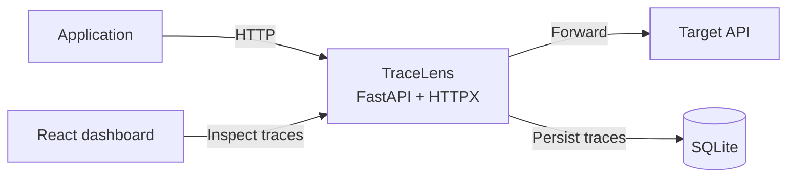

# TraceLens

**A local API observability and debugging proxy for developers.**

TraceLens sits between an application and its HTTP API. It forwards traffic to a configured target, records each exchange locally, and provides a dashboard for investigating requests, failures, and latency.



## Planned Usage

```bash
tracelens --target http://localhost:8000 --port 9000
```

Point an application at `http://localhost:9000`. TraceLens forwards requests to the target API and records the result locally.

## Development

```bash
cd backend
python3.12 -m venv .venv
.venv/bin/python -m pip install -e ".[dev]"
.venv/bin/python -m pytest
```

In another terminal, start the dashboard:

```bash
cd frontend
npm install
npm run dev
```

Open `http://127.0.0.1:5173`. Vite proxies local `/api` requests to TraceLens on port `9000`.

The backend supports Python $>=3.12,<3.15$.

## V1

- Async HTTP reverse proxy built with FastAPI and HTTPX
- SQLite-backed capture of request method, path, status, timestamp, and duration
- Trace APIs for listing, filtering, inspecting, and clearing traffic: `GET /api/traces`, `GET /api/traces/{id}`, and `DELETE /api/traces`
- Metrics API: `GET /api/metrics`
- React and TypeScript dashboard for traffic metrics and trace details
- Filters for endpoint, HTTP status, and latency
- Safe capture defaults: local binding, sensitive-header redaction, and bounded text-body capture

V1 is deliberately a local developer tool. HTTPS interception, streaming, remote deployment, anomaly detection, and AI analysis are deferred.

## Architecture

The full V1 implementation contract covers module boundaries, request lifecycle, data model, REST API, proxy behavior, failure handling, concurrency, privacy, testing, and architectural tradeoffs.

Read [the V1 architecture](docs/architecture.md#L1).

## Repository Layout

```text
tracelens/
  backend/                  # Python CLI, proxy, storage, and REST API
    tracelens/
      api/
      database/
      proxy/
      services/
    tests/
  frontend/                 # React and TypeScript dashboard
    src/
      components/
      hooks/
      pages/
      services/
  docs/
    architecture.md         # Canonical V1 technical design
    screenshots/            # Dashboard images and demos
  .github/
    workflows/              # CI
  README.md
  LICENSE
```

Directories appear as their corresponding implementation phases begin. This keeps the initial commit focused and avoids empty placeholders.

## Roadmap

- **V1:** local proxy, trace persistence, REST API, and dashboard
- **V2:** endpoint latency baselines and slow-request anomaly detection
- **V3:** optional failure analysis with explicit data-sharing controls

## Status

Phase 5 complete: React dashboard with live metrics, server-side traffic filters, trace detail inspection, and local-history clearing. Next: CI and project polish.