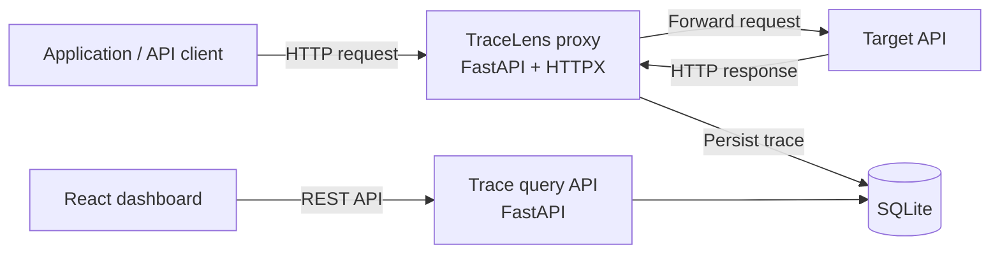

# TraceLens

TraceLens is a local HTTP observability proxy for developers. It forwards HTTP requests to a target API, records metadata about each exchange, and exposes a dashboard-friendly REST API for inspecting traffic, failures, and latency.

## V1 Goals

V1 is intentionally narrow:

1. Reverse proxy HTTP requests to one configured upstream target.
2. Capture request method, path, status code, timestamp, and duration.
3. Persist captured traces in local SQLite storage.
4. Expose REST APIs to list, inspect, filter, and clear traces.
5. Provide a React dashboard for recent traffic and summary metrics.
6. Filter traces by endpoint, HTTP status, and latency.

V1 is a local developer tool, not an API gateway or production monitoring platform.

## Non-Goals

The following are explicitly deferred:

- HTTPS interception and TLS certificate management.
- WebSockets, streaming responses, and HTTP/2-specific behavior.
- Authentication, multi-user access, or remote deployment.
- Distributed tracing and cross-service correlation.
- Alert delivery, anomaly detection, and LLM analysis.
- Docker packaging.

## System Architecture



TraceLens runs as one local Python process. The same FastAPI application owns both request forwarding and trace-query APIs. It listens on the configured proxy port, while its management endpoints live under `/api/*` and are never forwarded upstream.

## Request Lifecycle

```mermaid
sequenceDiagram
		participant C as Client
		participant T as TraceLens
		participant U as Target API
		participant D as SQLite

		C->>T: HTTP request
		T->>T: Record start time; sanitize capture data
		T->>U: Forward method, path, query, headers, and body
		U-->>T: Upstream response
		T->>T: Compute duration; build trace record
		T->>D: Persist trace
		T-->>C: Return upstream status, headers, and body
```

If the upstream cannot be reached or times out, TraceLens records a failed trace and returns `502 Bad Gateway` or `504 Gateway Timeout`. Persistence failures must not turn a successful upstream response into a failed client request: log the failure and still return the upstream response.

## Backend Structure

```text
backend/
	pyproject.toml
	tracelens/
		__init__.py
		main.py                 # Application factory and startup wiring
		config.py               # Environment and CLI configuration
		api/
			routes.py             # /api/traces and /api/metrics endpoints
			schemas.py            # Pydantic response and query models
		database/
			session.py            # SQLAlchemy engine and session factory
			models.py             # SQLAlchemy Trace model
		proxy/
			routes.py             # Catch-all forwarding route
			forwarding.py         # HTTPX forwarding and response translation
			capture.py            # Header/body sanitization and trace construction
		services/
			traces.py             # Persistence, filtering, and metrics queries
	tests/
		api/
		proxy/
		services/
```

The proxy route is the only component that communicates with the upstream. Route handlers remain thin; trace filtering, storage, and metric aggregation belong in the service layer.

## Data Model

`traces` is append-only in V1, except for explicit deletion through the management API.

| Field | Type | Notes |
| --- | --- | --- |
| `id` | integer | Primary key |
| `timestamp` | UTC datetime | Time TraceLens received the request |
| `method` | string | HTTP method, normalized to uppercase |
| `path` | string | Request path without upstream host |
| `query_string` | string, nullable | Raw query string |
| `status_code` | integer, nullable | Upstream status; null for connection failures |
| `duration_ms` | float | End-to-end proxy duration |
| `error_type` | string, nullable | `connect_error`, `timeout`, or `proxy_error` |
| `request_headers` | JSON text, nullable | Sanitized, allowlisted headers |
| `request_body` | text, nullable | Captured only when safe and within limits |
| `response_headers` | JSON text, nullable | Sanitized, allowlisted headers |
| `response_body` | text, nullable | Captured only when safe and within limits |

Indexes: `(timestamp DESC)`, `(path)`, `(status_code)`, and `(duration_ms)`.

## REST API Contract

All management endpoints are local and start with `/api`.

### `GET /api/traces`

Returns a paginated reverse-chronological list of trace summaries.

Query parameters:

| Parameter | Type | Default | Meaning |
| --- | --- | --- | --- |
| `limit` | integer | `50` | Number of traces, $1 \leq limit \leq 200$ |
| `offset` | integer | `0` | Pagination offset |
| `path` | string | none | Partial path match |
| `status_code` | integer | none | Exact HTTP status |
| `min_duration_ms` | float | none | Minimum latency |
| `max_duration_ms` | float | none | Maximum latency |

Response:

```json
{
	"items": [
		{
			"id": 42,
			"timestamp": "2026-08-16T12:41:08.124Z",
			"method": "GET",
			"path": "/users/42",
			"status_code": 200,
			"duration_ms": 84.2,
			"error_type": null
		}
	],
	"total": 1284,
	"limit": 50,
	"offset": 0
}
```

### `GET /api/traces/{trace_id}`

Returns the full captured trace, including safely captured headers and bodies. Returns `404` when no trace exists.

### `GET /api/metrics`

Returns metrics over the selected trace retention window. V1 computes these from SQLite on demand.

```json
{
	"request_count": 1284,
	"error_rate": 0.021,
	"average_duration_ms": 142.0,
	"p95_duration_ms": 387.0
}
```

An error is any trace with a `5xx` status or non-null `error_type`. P95 is computed from the nearest-rank percentile of recorded durations; no database-specific percentile function is required.

### `DELETE /api/traces`

Deletes all locally captured traces. Returns `204 No Content`.

## Proxy Behavior

The initial CLI contract is:

```bash
tracelens --target http://localhost:8000 --port 9000
```

- `--target` is required and must be an absolute `http` or `https` URL.
- `--port` defaults to `9000`.
- The upstream URL is built from the configured target base URL plus the incoming path and query string.
- Request method, query string, body, and end-to-end headers are forwarded, excluding hop-by-hop headers.
- Response status, body, and end-to-end headers are returned unchanged where possible.
- `Host`, `Connection`, `Keep-Alive`, `Proxy-Authenticate`, `Proxy-Authorization`, `TE`, `Trailer`, `Transfer-Encoding`, and `Upgrade` are never forwarded.
- `/api/*` is reserved for TraceLens management APIs and cannot be proxied.

## Error Handling

| Condition | Client result | Captured trace |
| --- | --- | --- |
| Upstream returns an HTTP response, including `4xx`/`5xx` | Preserve upstream response | Status and duration |
| DNS, connection, or TLS error | `502 Bad Gateway` | `error_type: connect_error` |
| Upstream timeout | `504 Gateway Timeout` | `error_type: timeout` |
| Unexpected proxy exception | `502 Bad Gateway` | `error_type: proxy_error` when possible |
| SQLite write failure | Preserve client result | Log locally; no trace record |

Proxy error responses use a small JSON body with a stable `detail` field. Internal exception details are written only to local logs, never returned to the client.

## Async and Concurrency

- FastAPI route handlers and HTTPX forwarding run asynchronously.
- Use one application-scoped `httpx.AsyncClient` so connection pooling is shared safely across requests.
- Use SQLAlchemy's async SQLite engine with `aiosqlite`.
- Keep request capture bounded: body reads have a configurable maximum size and never load unbounded streams into memory.
- Initial defaults: `30` second upstream timeout and `64 KiB` maximum captured request or response body.
- V1 supports normal buffered HTTP responses only; streaming behavior is deferred because capturing and replaying streams changes backpressure semantics.

## Privacy and Security

TraceLens captures data that may include credentials or personal information. Local-only deployment reduces exposure but does not remove the risk.

- Bind to `127.0.0.1` by default.
- Store data only in a local SQLite file; do not send telemetry.
- Redact values for `Authorization`, `Cookie`, `Set-Cookie`, `X-Api-Key`, and headers matching configurable sensitive-name patterns.
- Do not capture multipart or binary request/response bodies in V1.
- Capture JSON, text, and form bodies only when their content type is recognized and their size is within the configured limit.
- Document that trace storage can contain sensitive information and provide `DELETE /api/traces` as an immediate local purge.

## Frontend V1

The React/TypeScript dashboard has two views:

1. **Traffic**: request count, error rate, average latency, P95 latency, filters, and a reverse-chronological trace table.
2. **Trace Detail**: method, path, status, duration, timestamp, request/response headers and bodies, and error information.

The dashboard polls `GET /api/traces` and `GET /api/metrics` every two seconds while the Traffic view is active. Detail is loaded on demand. Server-side filtering remains authoritative so the UI does not need to load the full trace history.

## Testing Strategy

| Layer | Coverage |
| --- | --- |
| Proxy | Forwarding method/path/query/body, filtered headers, returned response, timeout and connection failures |
| Capture | Sensitive-header redaction, content-type checks, and body-size limits |
| Persistence | Trace creation, ordering, filtering, clear operation, and metric calculations |
| API | Query validation, pagination, detail `404`, response schemas, and clear endpoint |
| Frontend | Filter controls, table states, detail rendering, and API error states |

Tests use `pytest`, `pytest-asyncio`, FastAPI's `TestClient` or `httpx.AsyncClient`, a temporary SQLite database, and an HTTPX mock transport for deterministic upstream responses.

## Decisions Before Implementation

| Decision | V1 choice | Reason and tradeoff |
| --- | --- | --- |
| Application shape | One FastAPI process | Fastest local workflow; management API shares process with proxy |
| Storage | SQLite via async SQLAlchemy | Portable and inspectable; not intended for high-volume retention |
| Trace writes | Inline after upstream response | Ensures capture before client response; adds small latency versus a queue |
| Body capture | Opt-in-safe types, 64 KiB cap, redaction | Useful debugging data without unbounded or binary capture |
| Metrics | On-demand SQL/query calculation | Simple and correct for local volumes; pre-aggregation can come later |
| Upstream errors | Preserve HTTP responses; synthesize gateway errors only for transport failures | Separates API failures from proxy failures |
| UI updates | Two-second polling | Simple local-first behavior; WebSockets are deferred |

## Proposed Repository Structure

```text
tracelens/
	backend/
	frontend/
	docs/
		architecture.md
	.github/
		workflows/
	README.md
	LICENSE
```

## Delivery Plan

1. Bootstrap the Python package, configuration, CLI, and FastAPI application factory.
2. Implement and test proxy forwarding with HTTPX.
3. Add the SQLite trace model, capture policy, and persistence.
4. Add trace and metric REST APIs.
5. Build the React dashboard and trace-detail view.
6. Add CI and polish project documentation.

## Roadmap

- **V2:** endpoint latency baselines and slow-request anomaly detection.
- **V3:** optional local or hosted LLM-powered failure analysis, with explicit data-sharing controls.
